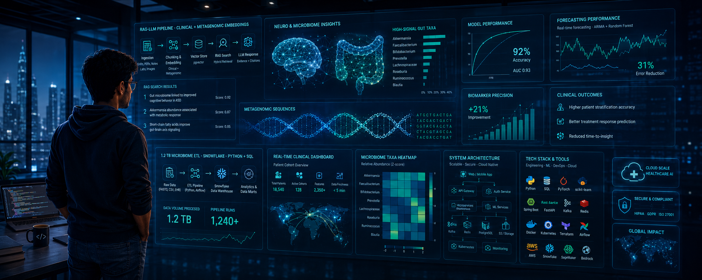

<div align="center">



# 👋 Hi, I'm Brijesh Kumar

### Full‑Stack Engineer · ML Researcher · Systems Builder  
**MS Computer Science @ Arizona State University · 4.0 GPA · Tempe, AZ**

[](https://brijeshbuilds.vercel.app)
[](https://linkedin.com/in/brijeshkumar03)
[](mailto:bkumar25@asu.edu)
[](https://leetcode.com/brijesh03032001)
[](https://github.com/Brijesh03032001)

**📍 Tempe, AZ · ☎️ 623‑666‑2665 · Open to CPT / OPT · Actively seeking Summer 2026 internships**


</div>

---

## 🎯 What I Do

- **Build production systems** that stay up: sub‑150ms latency, 99.99% uptime, and 10K+ concurrent users.
- **Ship full‑stack platforms** with Java/Spring Boot, Python/FastAPI, React/Next.js, PostgreSQL, Redis, and AWS.
- **Design ML & GenAI pipelines** (RAG, forecasting, embeddings) on real‑world data at TB scale.
- **Work across the stack**: backend architecture, data pipelines, microservices, and frontend UX.

---

## 🔬 Current Role · ASU Biodesign Institute

**Machine Learning Research Aide · Jan 2025 – Present · Tempe, AZ**

I work on large‑scale microbiome and clinical datasets to power real‑world healthcare decision‑making:

- Deployed **RAG‑LLM pipelines** with cosine‑similarity vector search on clinical + metagenomic embeddings, improving biomarker discovery precision by **21%** across **3 disease domains**.
- Built **Python + SQL + Snowflake ETL** on a **1.2TB** microbiome dataset, with skew‑aware partitioning that cut LLM feature prep time by **65%** on nightly AWS training pipelines.
- Designed **hybrid ARIMA + Random Forest** forecasting pipelines, reaching **92% accuracy** and reducing clinician forecast error by **31%** versus prior baselines.
- Automated **EDA, hypothesis testing, and statistical modeling** (Python/R) across 1.2TB clinical cohorts, surfacing **17 high‑signal gut taxa** that shaped downstream feature engineering and LLM features.
- Built **Power BI dashboards** on ETL outputs with KPI layers, cutting reporting turnaround by **40%**, queried daily by **30+ clinical research stakeholders**.

---

## 💼 Software Engineering Experience

### EdPlus @ Arizona State University · Software Developer  
**Sep 2025 – Present · Tempe, AZ**

- Built **GenAI tutoring and content pipelines** with **AWS Bedrock + Amazon SageMaker**, delivering adaptive tutoring, AI content recommendations, and quiz generation for **10K+ ASU Online learners**, boosting engagement by **28%**.
- Developed **Student Enrollment Service** in **Java Spring Boot** (registration, seat allocation, waitlists), reducing REST API latency by **42%** through query optimization and profiling.
- Implemented **Course Delivery & Notification Services** with async Spring and **AWS Lambda** triggers on S3‑backed content pipelines, increasing throughput by **35%** and delivering real‑time grade alerts and deadline reminders.
- Automated infra (EC2, IAM, VPC, Lambda) using **Terraform**, eliminating config drift and cutting provisioning time by **60%**.
- Designed **GitHub Actions CI/CD** with tests, lint gates, and zero‑downtime deploys, improving release velocity by **2.1×**.

### AWL Metaverse Pvt. Ltd. · Software Engineer  
**Mar 2024 – Dec 2024 · India**

- Built **Dockerized FastAPI microservices** for auth, enrollment, and assignments on **AWS EC2**, cutting deployment cycles by **45%**.
- Scheduled Cron‑based automation for progress reports and deadline reminders, reducing manual ops by **40%**.
- Secured APIs with **JWT/OAuth2 + Pydantic validation**, reducing invalid requests by **80%** and improving data integrity.
- Designed **PostgreSQL schemas** with compound indexes and JSONB fields, improving query performance **3×** and cutting p99 latency by **40%**.

### Quicket Solutions · Software Developer  
**Mar 2023 – Mar 2024 · India**

- Built **15+ React components** for Stripe checkout (card input, 3DS, confirmation), increasing payment success rates by **30%**.
- Implemented **Redis caching** on high‑traffic payment endpoints, reducing DB load by **60%** and end‑to‑end latency by **40%**.
- Designed **GraphQL + REST APIs** with batching, retries, and circuit breakers, improving inter‑service reliability by **42%**.

**Software Developer Intern · Oct 2022 – Feb 2023**

- Developed **serverless ETL pipelines** with **AWS Lambda, S3, RDS**, improving processing efficiency by **35%**.
- Provisioned EC2, IAM, and VPC via **Terraform**, cutting environment setup time by **50%**.
- Shipped **10+ REST APIs** and removed N+1 queries via indexed joins, cutting average API response time by **35%**; awarded **Best Intern**.

---

## 🧩 Selected Systems & Projects

> A few projects that represent how I design, build, and ship systems end‑to‑end.

### 🔹 TrustmedAi – Advanced Medical RAG Platform

**Stack:** Python · FastAPI · LangChain · FAISS / Vector DB · AWS  
**Focus:** Clinical QA and biomarker discovery support using retrieval‑augmented generation.

- Designed an **end‑to‑end RAG pipeline** over medical PDFs, guidelines, and structured cohorts to answer clinician‑style queries with grounded citations.
- Implemented **chunking, embedding, reranking, and prompt strategies** to reduce hallucinations and keep responses tied to validated sources.
- Integrated evaluation scripts and prompt sets to systematically compare retrieval strategies and prompt templates.

> GitHub: `TrustmedAi` (Advanced RAG system)

---

### 🔹 StudySliceAI – AI Study Copilot on AWS

**Stack:** Next.js / React · Python / FastAPI · AWS (Lambda, API Gateway, S3, RDS or DynamoDB)  
**Focus:** Personal study assistant that organizes notes, generates quizzes, and explains concepts using GenAI.

- Built a **full‑stack learning platform** where students upload content and receive AI‑generated summaries, flashcards, and practice questions.
- Deployed backend services on **AWS** with API Gateway + Lambda and persistent storage, designing APIs for session management, content ingestion, and retrieval.
- Implemented authentication, role‑based access, and a responsive UI so the app feels like a polished SaaS product rather than a demo.

> GitHub: `StudySliceAI`

---

### 🔹 SlackAgent – Multi‑Agent Dev Productivity Copilot

**Stack:** Python · FastAPI · LangChain / OpenAI · Slack, GitHub, Notion APIs  
**Focus:** “Open‑claw–style” agent that connects Slack, GitHub, and Notion to answer questions and automate workflows.

- Orchestrated **multi‑tool agents** that can read Slack threads, fetch GitHub issues/PRs, and query Notion docs to answer “what’s going on with X?” in one place.
- Implemented tool abstractions for each integration (Slack, GitHub, Notion) and an orchestration layer to route user intent to the right tools.
- Designed the system so teams can plug it into their existing Slack workspace and immediately get value without heavy setup.

> GitHub: `SlackAgent`

---

### 🔹 Nexus – Smart Contact Graph for Business Networks

**Stack:** Java · Spring Boot · AWS Bedrock · FAISS · Redis · Apache Kafka  
**Focus:** AI‑enhanced contact manager and relationship graph for business networking.

- Built an **event‑driven microservices architecture** with Kafka, aggregating contact events across systems into a unified graph.
- Integrated **AWS Bedrock** + FAISS to embed contact metadata and surface high‑value relationships, improving contact matching accuracy by **70%**.
- Tuned pipelines to deliver **sub‑3 second** network analysis queries at scale using Redis caching and optimized queries.

> GitHub: `Nexus`

---

### 🔹 FashionRecommender – Real‑Time Vision‑Based Outfit Engine

**Stack:** Python · FastAPI · CLIP · ResNet50 · AWS  
**Focus:** Real‑time fashion recommendation using image embeddings and similarity search.

- Built a **computer‑vision‑powered recommendation system** that serves personalized outfit suggestions in production.
- Optimized for **<150ms** response times for **10K+ concurrent users** with **99.99% uptime**, using efficient batching and model serving on AWS.
- Improved user engagement by **32%** with targeted recommendations versus simple rule‑based suggestions.

> GitHub: `FashionRecommender`

---

## 🛠️ Tech Stack

**Backend & Systems**

- Languages: `Python` · `Java` · `TypeScript` · `JavaScript`  
- Frameworks: `Spring Boot` · `FastAPI` · `Flask` · `Node.js`  
- Architectures: `Microservices` · `REST` · `GraphQL` · `Event‑Driven`  
- Messaging & Caching: `Apache Kafka` · `Redis` · `Redis Pub/Sub`  
- Testing: `Pytest` · `JUnit` · `Jest`

**Frontend & UX**

- Frameworks: `React` · `Next.js`  
- Styling & UI: `Tailwind CSS` · `shadcn/ui` · `Material‑UI` · `Ant Design` · `Chakra UI`  
- Patterns: Responsive design, Progressive Web Apps, dashboard‑driven UX

**AI/ML & Data**

- Libraries: `PyTorch` · `TensorFlow` · `Keras` · `scikit‑learn` · `Pandas` · `NumPy`  
- GenAI & NLP: `Hugging Face` · `LangChain` · `RAG` · `Vector Embeddings`  
- CV: `OpenCV` · `CLIP` · `ResNet`  
- Big Data: `PySpark`  
- MLOps: `MLflow` · `Weights & Biases`  
- Analytics & Viz: `Power BI` · `Tableau` · `Matplotlib` · `D3.js`  

**Cloud, DevOps & Infra**

- Cloud: `AWS` · `GCP` · `Vercel`  
- Orchestration & Containers: `Docker` · `Kubernetes`  
- IaC & CI/CD: `Terraform` · `GitHub Actions` · `Jenkins`  
- Monitoring: `CloudWatch` · `Prometheus` · `Grafana` · `New Relic`  
- Databases: `PostgreSQL` · `MongoDB` · `SQLite`  

---

## 🏆 Achievements

```
╔═══════════════════════════════════════════════════════════════════════════════╗
║                         COMPETITIVE PROGRAMMING                              ║
╠═══════════════════════════════════════════════════════════════════════════════╣
║  🥇  Top 0.2% in CodeKaze — Rank 315 out of 150,000 participants            ║
║  🧩  1,000+ LeetCode Problems Solved (C++)                                   ║
║  🏆  Hackathon Champion (4×) — top 1% out of 10,000+ participants           ║
║  🎯  Finalist: JPMorgan Code for Good 2024                                  ║
╚═══════════════════════════════════════════════════════════════════════════════╝

╔═══════════════════════════════════════════════════════════════════════════════╗
║                        RESEARCH & CERTIFICATIONS                             ║
╠═══════════════════════════════════════════════════════════════════════════════╣
║  📄  Research Publication — "Early Dementia Detection via ANN Segmentation" ║
║      Published in Springer · Cited across academic repositories             ║
║  🎓  IBM Data Science Certificate (Coursera) — Top 5% globally              ║
║  🧠  Deep Learning Specialization (DeepLearning.AI)                          ║
║      CNNs · RNNs · NLP · Optimization for real-world AI systems             ║
║  🌍  Open Source — Hacktoberfest 2025 · 6+ merged PRs across OSS repos     ║
╚═══════════════════════════════════════════════════════════════════════════════╝
```

---

## 📊 GitHub at a Glance

<div align="center">


</div>

---

## 🤝 Let’s Build Something

**I’m actively seeking Summer 2026 internships (Backend · Full‑Stack · AI/ML).**  

- ✅ **CPT/OPT eligible**  
- 📍 Tempe / Phoenix, AZ (open to relocation)  
- 🎯 Interested in scalable systems, GenAI products, and data‑driven platforms that actually ship to users  

If you’re building something ambitious and need someone who can own the path from **data → models → backend → production**, I’d love to chat.

</br>

<div align="center">

**“I build systems that scale and solve problems that matter.”**  

</div>