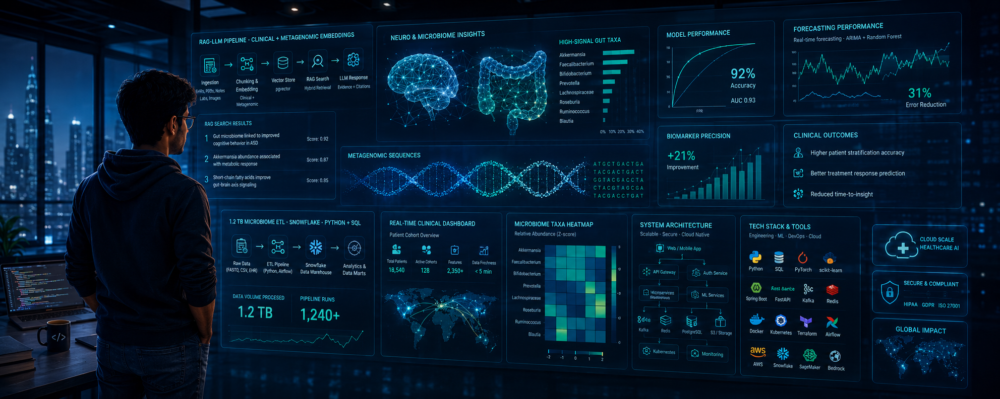

<div align="center">



# 👋 Hi, I'm Brijesh Kumar

### AI Software Engineer · Full‑Stack Developer · Applied ML/GenAI
**MS Computer Science @ Arizona State University · 4.0 GPA · Tempe, AZ**

[](https://brijeshbuilds.com)
[](https://linkedin.com/in/brijeshkumar03)
[](mailto:kumarbrijesh.dev@outlook.com)
[](https://leetcode.com/brijesh03032001)
[](https://github.com/Brijesh03032001)

**📍 Tempe, AZ · Graduating December 2026 · Open to full‑time Applied AI / Software Engineering roles**


<br/>


</div>

---

## 🎯 What I Work On

- **Retrieval and agent systems that have to be right, not just fluent**: RAG pipelines, multi-agent orchestration, and tool-calling agents with evaluation harnesses and grounding checks behind them.
- **Full-stack products end to end**: React/Next.js and FastAPI/Spring Boot services backed by PostgreSQL, Redis, and pgvector, deployed on AWS with Terraform and CI/CD.
- **Guardrails over raw capability**: human-in-the-loop confirmation, golden-set evaluation, and failure recovery for systems where a wrong AI action has real cost.
- **ML on real-world clinical and behavioral data**: forecasting and biomarker-discovery pipelines built with research teams, not just personal projects.

---

## 💼 Experience

### EdPlus at Arizona State University · AI Software Engineer
**Sep 2025 – Present · Tempe, AZ**

- Shipped the customer-facing React and Next.js web application used in 100+ recorded sessions, resolving natural-language queries to exact timestamps in under 3 seconds via a pgvector-backed vector store over 10,000+ embeddings and three coordinated LangChain agents.
- Confirmed 89% agreement with a manually labeled golden set of 300+ video chunks with an evaluation harness and a hard editor-confirmation guardrail, holding unauthorized AI deletions at zero in production.
- Sustained p95 latency under 3 seconds at 10+ concurrent chunk-processing jobs over 15+ async FastAPI REST endpoints spanning 4 core workflow areas and background task orchestration.
- Slashed infrastructure setup time 60% provisioning S3, IAM, ECS Fargate, and Lambda through Terraform across 4 AWS resource groups, sustaining 99.5%+ uptime with CloudWatch alerting behind an autoscaling load balancer.
- Added a CLIP embedding step on a SageMaker endpoint over frames sampled from silent transcript gaps, making screen-share and whiteboard moments searchable by text query — CLIP is a pretrained vision-language model; the gap detection, frame sampling, and merge logic are mine.

### ASU Biodesign Institute · Machine Learning Research Analyst
**Feb 2025 – Present · Tempe, AZ**

- Traveled on-site to 3 partner clinics (60–80 patients each) to learn clinician workflows, then configured and deployed a RAG-LLM document-search product over ~2,000 indexed PDF documents, validating retrieval behavior with live users and training them directly.
- Cut unsupported clinical-answer claims 35% against an ungrounded baseline, across 560 clinical questions labeled by clinicians and Dr. Nirmalkar's team, by having the LLM tool-call a FAISS retrieval function followed by a grounding-check function inside an evaluation loop.
- Lifted biomarker-discovery precision 21% across 3 research domains with a RAG pipeline combining FAISS cosine-similarity retrieval over clinical, metagenomic, and literature embeddings.
- Built a Python + SQL + Snowflake ETL pipeline on a 1.2TB microbiome dataset with skew-aware partitioning, cutting LLM feature-prep time 65% on nightly AWS training runs and surfacing 17 high-signal gut taxa that shaped downstream feature engineering.
- Designed hybrid ARIMA + Random Forest forecasting pipelines reaching 92% accuracy (31% lower clinician forecast error vs. prior baselines), and built Power BI dashboards that cut reporting turnaround 40% for 30+ clinical research stakeholders.

### AWL Metaverse Pvt. Ltd. · Software Engineer
**Mar 2024 – Dec 2024 · India**

- Sustained smooth playback for 5,000+ concurrent video sessions with a React and TypeScript student video player built on chunk-based streaming and adaptive buffering across a full EdTech platform.
- Trimmed mobile bounce rate 25% by building responsive React components across video, quiz, and chatbot modules, validated with Jest and React Testing Library at 82% test coverage.
- Built Dockerized FastAPI microservices for auth, enrollment, and assignments on AWS EC2 — cutting deployment cycles 45% and manual reporting/reminder ops 40% via Cron-based automation.
- Secured APIs with JWT/OAuth2 and Pydantic validation (cutting invalid requests 80%), and designed PostgreSQL schemas with compound indexes and JSONB fields, improving query performance 3× and cutting p99 latency 40%.

### Quicket Solutions · Software Developer (promoted from Intern)
**Software Developer: Mar 2023 – Mar 2024 · Intern: Oct 2022 – Feb 2023 · India**

- Improved inter-service reliability to 99.6% with Redis caching and circuit-breaker patterns adopted across three engineering teams, cutting database load 60% during concurrent traffic spikes.
- Strengthened payment-data integrity behind REST APIs through indexed PostgreSQL schema design, idempotency-key handling, and Stripe-to-ledger reconciliation, eliminating duplicate charges during network-timeout retries.
- Built 15+ React components for Stripe checkout (card input, 3DS, confirmation), lifting payment success rates 30%, and removed N+1 queries via indexed joins, cutting average API response time 35%.
- As an intern, developed serverless ETL pipelines with AWS Lambda, S3, and RDS (35% efficiency gain) and provisioned EC2/IAM/VPC via Terraform (50% faster environment setup) — awarded Best Intern.

---

## 🗂️ Selected Projects

### 🌮 [FoodPilot AI](https://github.com/Brijesh03032001/foodai) — Agentic Food-Truck Marketplace
**Stack:** Next.js · Spring Boot · FastAPI · LangChain · LangGraph · ChromaDB
A four-tier food-truck marketplace with an AI concierge for customers and an AI operations copilot for owners, over 107 trucks, 635 dishes, and 150 reviews. A ReAct Owner Copilot calls a SQL sales-stats tool and a vector review-search tool to answer "why did sales drop?"; a deterministic Order Builder validates every generated order line against 2,622 real modifiers, flagging each as applied or rejected with a reason, with a human confirming before checkout.

### 👻 [Ghosty](https://github.com/Brijesh03032001/Ghosty_A_Conference_helper) — Conference Follow-Up Assistant
**Stack:** React Native (Expo) · OpenAI Whisper · Anthropic Claude
A voice-first mobile app that turns a 15-second voice memo after a conversation into a structured contact card with a transparent "Connection Value Score" and an AI-drafted, context-aware follow-up. Winner, Kiro Spark Challenge 2026 (ASU, 24-hour AWS-sponsored hackathon).

### 📚 [StudySliceAI](https://github.com/Brijesh03032001/StudySliceAI) — Lecture-to-Study-Clips Pipeline
**Stack:** AWS S3 · AWS Transcribe · FFmpeg
Turns long recorded lectures into short, focused study clips: uploads to S3, transcribes with AWS Transcribe, identifies key concepts, and cuts clips with FFmpeg. Runner-up, SunHacks 2025 (Education Track).

### 👗 [StyleNova-AI](https://github.com/Brijesh03032001/StyleNova-AI) — Vision-Language Outfit Recommender
**Stack:** Python · PyTorch · OpenAI CLIP · FastAPI · Next.js
A recommender that blends CLIP image/text embeddings with a per-user preference vector (built from swipe likes/dislikes with exponential decay) behind a swipe-based UI. CLIP is a pretrained vision-language model that embeds images and text into a shared space, not an object detector — the preference-blending logic, swipe feedback loop, and serving layer are mine.

### 🤖 [SlackAgent](https://github.com/Brijesh03032001/SlackAgent) — Slack + GitHub + Notion AI Agent
**Stack:** TypeScript · Node.js · OpenAI GPT-4o · Model Context Protocol · ChromaDB · mem0.ai
Exposes 59 tools to one GPT-4o agent — 12 Slack tools I wrote directly, plus 47 more (26 GitHub, 21 Notion) via off-the-shelf MCP servers — reaching a 97.2% tool-call success rate across 100+ concurrent conversations, with RAG over indexed Slack history and long-term memory via mem0.

### 🕸️ [Nexus](https://github.com/Brijesh03032001/Nexus) — Smart Contact Manager
**Stack:** Next.js · TypeScript · Convex · Clerk · Anthropic Claude
A CRM for professional relationships with a rule-based contact-deduplication engine (Levenshtein distance + email/phone/company matching, 0–100% confidence scoring) on Convex, with Clerk auth. Claude 3.5 Sonnet powers email-draft generation and search-query parsing; the in-app assistant chat is currently a scaffolded/demo response layer, not yet wired to a live model call.

### 🍽️ [SwiggyAnalysis](https://github.com/Brijesh03032001/SwiggyAnalysis) — Swiggy Market Intelligence Engine
**Stack:** Python · Pandas · Plotly · Streamlit · SQLite
A market-intelligence dashboard analyzing food-delivery order data for growth-team decision support.

---

## 🛠️ Tech Stack

**Frontend & Product**
`React` · `Next.js` · `TypeScript` · `Redux` · `Tailwind CSS` · `Jest` · `React Testing Library`

**Backend, APIs & Data**
`Python` · `FastAPI` · `Java` · `Spring Boot` · `REST APIs` · `PostgreSQL` · `Redis` · `Convex`

**LLM Product & Agents**
`LangChain` · `LangGraph` · `Model Context Protocol` · `Multi-Agent Orchestration` · `Tool Calling` · `RAG` · `FAISS` · `ChromaDB` · `pgvector` · `CLIP`

**Evaluation, Reliability & Safety**
Evaluation Harnesses · Golden Sets · Grounding · Guardrails · Human-in-the-Loop · Concurrency · Failure Recovery

**Cloud & Delivery**
`AWS` (EC2, S3, ECS Fargate, Lambda, SageMaker, Bedrock) · `Terraform` · `Docker` · `GitHub Actions` · `CloudWatch`

---

## 🏆 Achievements

```
╔═══════════════════════════════════════════════════════════════════════════════╗
║                      HACKATHONS & COMPETITIONS (4)                           ║
╠═══════════════════════════════════════════════════════════════════════════════╣
║  🥇  Winner — Kiro Spark Challenge 2026 (ASU × AWS, 24-hour build) → Ghosty ║
║  🥇  Winner — CrozeAI Hackathon                                             ║
║  🥉  Top 3 — EmotiSphere Hackathon                                          ║
║  🥈  Runner-up — SunHacks 2025, Education Track → StudySliceAI             ║
║  🎯  Finalist — JPMorgan Code for Good 2024                                 ║
╚═══════════════════════════════════════════════════════════════════════════════╝

╔═══════════════════════════════════════════════════════════════════════════════╗
║                         COMPETITIVE PROGRAMMING                              ║
╠═══════════════════════════════════════════════════════════════════════════════╣
║  🥇  Top 0.2% in CodeKaze — Rank 315 out of 150,000 participants            ║
║  🧩  1,000+ LeetCode Problems Solved (C++)                                   ║
║  ✅  HackerRank — Problem Solving (Intermediate), Jul 2024                  ║
╚═══════════════════════════════════════════════════════════════════════════════╝

╔═══════════════════════════════════════════════════════════════════════════════╗
║                RESEARCH, CERTIFICATIONS & STARTUP PROGRAMS                    ║
╠═══════════════════════════════════════════════════════════════════════════════╣
║  📄  Springer Publication — "Early Dementia Detection and Classification    ║
║      of Stage by Efficient Segmentation and Artificial Neural Network"      ║
║  🚀  Accepted — Y Combinator Startup School 2026                            ║
║  🎓  Data Science Professional Certificate — IBM                            ║
║  🧠  Deep Learning Professional Certificate — DeepLearning.AI               ║
║  🌍  Open Source Super Contributor — Hacktoberfest 2025 · 6+ merged PRs    ║
╚═══════════════════════════════════════════════════════════════════════════════╝
```

---

## 📊 GitHub at a Glance

<div align="center">


</div>

---

## 🤝 Let's Build Something

**Graduating December 2026, open to full-time Applied AI / Software Engineering roles.**

- 📍 Tempe / Phoenix, AZ (open to relocation)
- 🎯 Interested in retrieval systems, multi-agent products, and data-driven platforms that ship to real users
- 🎓 Authorized to work in the U.S. on OPT following graduation

If you're building something ambitious and need someone who can own the path from **data → models → backend → production**, I'd love to chat.

<br/>

<div align="center">

**"I build systems that scale and solve problems that matter."**

</div>
